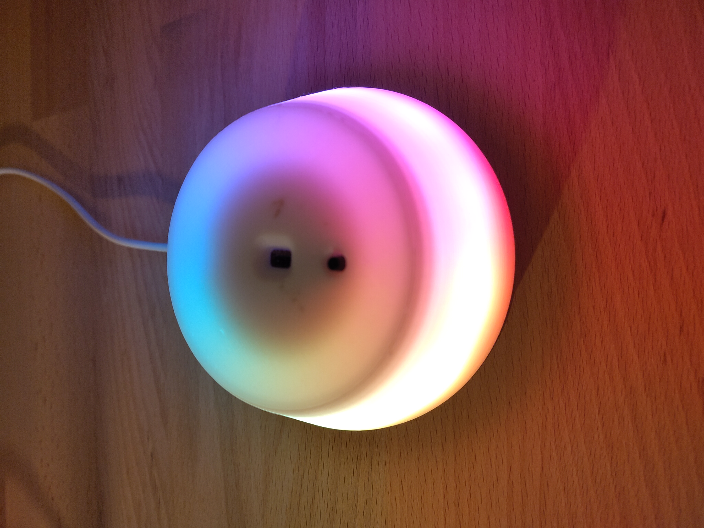
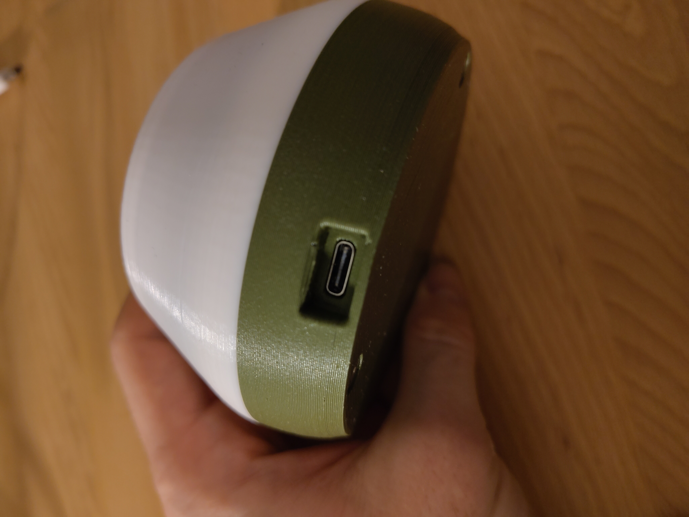
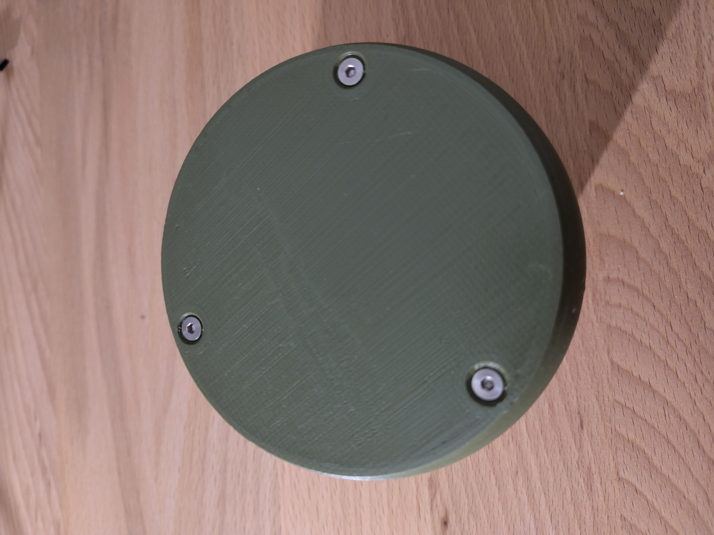
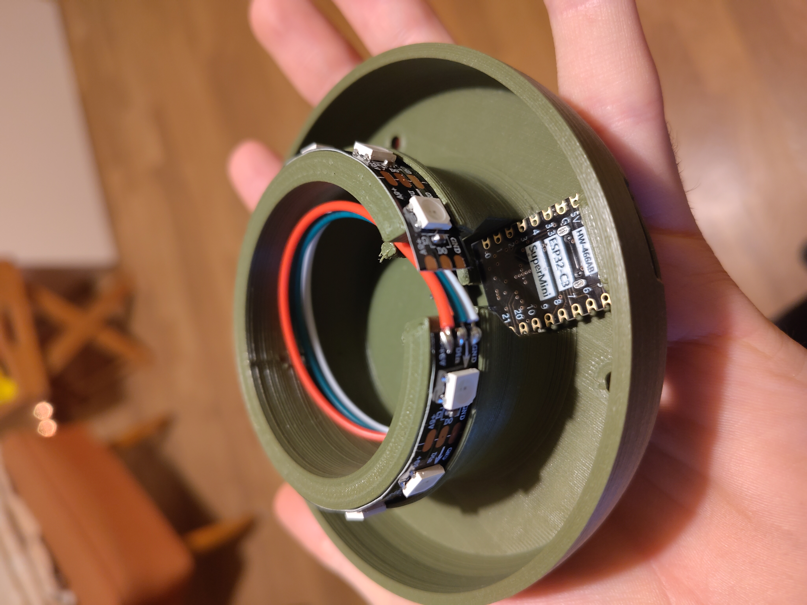

# GlowLight

This repository contains the software, schematics, and 3D printing files for a bedside lamp. The software includes various modes that can be toggled using a button. Additionally, there is a distance sensor (`VL53L0X`) that enables features such as adjusting the lamp's brightness with a hand gesture.

## Pictures

<table>
  <tr>
    <td></td>
    <td></td>
    <td></td>
    <td></td>
</table>

This is an overview of the different modes available in the lamp. The modes can be toggled using the button.

## Hardware Components

- Seeed Xiao ESP32C3
- VL53L0X distance sensor
- Simple push button
- WS2812B 5V LED strip
- External 5V power supply
- USB-C and other necessary cables
- M3 screws

## Tools and Materials

- 3D printer + filament (white and a color of your choice)
- Soldering iron
- Screwdriver

## Software Installation

This is a PlatformIO project. To compile and flash the software to the ESP32C3, PlatformIO must be installed. Once installed, you can open the project in PlatformIO and flash the software onto the ESP32C3.

Alternatively, a `Makefile` is included, allowing you to flash the software via the command line. For this, PlatformIO must be installed, and the `PLATFORMIO` environment variable should point to the PlatformIO executable.

If you're familiar with Nix-shell, you can use the [`shell.nix`](/shell.nix) file to set up the environment for PlatformIO.

### PlatformIO Commands

- `pio run`: Compiles the software
- `pio run --target upload`: Flashes the software to the ESP32C3
- `pio run --target clean`: Removes compiled files
- `pio device monitor`: Opens a terminal to view the ESP32C3 output

### Makefile Commands

- `make`: Compiles the software
- `make upload`: Flashes the software to the ESP32C3
- `make clean`: Removes compiled files
- `make monitor`: Opens a terminal to view the ESP32C3 output
- `make flash`: Flashes the software and opens the monitor
- `make start`: Cleans, compiles, flashes the software, and opens the monitor

## 3D Printing

> **Note:** The 3D models are not yet finalized but will be made available soon.

The `print` folder contains STL files for the lamp's 3D models. These files are designed for 3D printers with a build volume of at least 200x200x200mm.

## Libraries Used

- [`ArrayList`](https://registry.platformio.org/libraries/braydenanderson2014/ArrayList) for dynamic arrays
- [`Button2`](https://registry.platformio.org/libraries/lennarthennigs/Button2) for button input handling
- [`VL53L0X`](https://registry.platformio.org/libraries/pololu/VL53L0X) for the distance sensor
- [`FastLED`](https://registry.platformio.org/libraries/fastled/FastLED) for LED control

For more details on the libraries, refer to the [`platformio.ini`](/platformio.ini) file.

## License

This project is licensed under the GNU General Public License v3.0. For more information, see the [`LICENSE`](/LICENSE) file.
