# 🌟 GlowLight - Smart Wireless Bedside Lamp

[](https://www.gnu.org/licenses/gpl-3.0)
[](https://www.espressif.com/en/products/socs/esp32-c3)
[](https://www.arduino.cc/)

A beautiful, smart bedside lamp with ESP-NOW wireless communication, gesture controls, and multiple lighting modes. Built on ESP32-C3 with 3D-printed components and WS2812B LED strips.

## 📋 Table of Contents

- [✨ Features](#-features)
- [🎭 Available Lighting Modes](#-available-lighting-modes)
- [📸 Gallery](#-gallery)
- [🔗 ESP-NOW Wireless Communication](#-esp-now-wireless-communication)
  - [Configuration](#configuration)
  - [🏠 Home Assistant](#-home-assistant)
- [🔧 Hardware Components](#-hardware-components)
  - [Main Components](#main-components)
  - [3D Printing](#3d-printing)
  - [Soldering](#soldering)
- [🚀 Quick Setup](#-quick-setup)
- [📦 Software Installation (Advanced)](#-software-installation-advanced)
- [👨‍💻 Development](#-development)
  - [Project Structure](#project-structure)
  - [Documentation](#documentation)
  - [Testing](#testing)
  - [Modes](#modes)
- [📄 License](#-license)

## ✨ Features

- **🎨 Multiple Lighting Modes**: Static colors, rainbow, beacon, candle effect, and more
- **⚡ ESP-NOW Communication**: Ultra-fast (<10ms) wireless synchronization between lamps
- **🔐 Encrypted Group Transport**: AES-256-GCM with a shared group key, authenticated peers and replay protection, up to 8 lamps per group
- **🔀 Per-Lamp Sync Control**: Follow and publish are independent switches, so a lamp can go its own way and rejoin later
- **🏠 Home Assistant**: Optional MQTT integration that announces its own entities, generated from the modes in the firmware
- **📶 Optional WiFi**: Infrastructure WiFi alongside ESP-NOW, with a captive portal for provisioning without reflashing
- **⬆️ Password-Protected OTA**: Firmware updates over WiFi with digest authentication and image verification
- **👋 Gesture Control**: Hand proximity sensing with VL53L0X distance sensor
- **🔘 Physical Controls**: Simple button interface for mode switching
- **🏠 3D Printable**: Complete STL files for custom lamp housing
- **🔧 Easy Setup**: One-command installation with interactive configuration
- **📱 Device Management**: Automatic ESP32 detection and flashing
- **💾 Backup System**: Configuration backup and restore

## 🎭 Available Lighting Modes

### Active Modes
- **🎨 StaticMode**: Single solid color with full brightness control
- **🌈 ColorPickerMode**: Cycle through color spectrum with distance sensor
- **🌈 RainbowMode**: Classic flowing rainbow effect with speed control
- **✨ RandomGlowMode**: 10-color random transitions with zen to party speeds
  - *NEW v3.3.0*: Enhanced with 10 scientifically distributed colors (every 36° in HSV space)
  - Features: Pause/transition cycles, inherited brightness control, mesh synchronization
  - Speed modes: Zen (meditative) → Normal → Lebendig (energetic) → Hektisch (party)

### Optional Modes
- **🕯️ CandleMode**: Realistic candle flicker simulation
- **🚨 BeaconMode**: Beacon/alert patterns for notifications
- **🌅 SunsetMode**: Natural sunset simulation for bedtime
- **💫 StrobeMode**: Synchronized strobe effects over ESP-NOW
- **🎮 MiniGame**: Interactive games using distance sensor

> **Note**: Mode selection is declared in `include/ModeConfig.h`. Set an individual
> `GLOW_ENABLE_*` switch to `1`, or use the `esp32c3-all-modes` build profile.

## 📸 Gallery

<table>
  <tr>
    <td>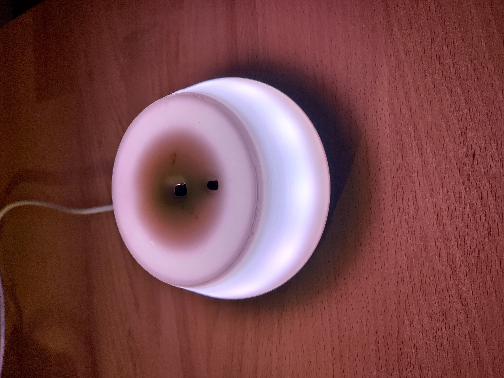</td>
    <td>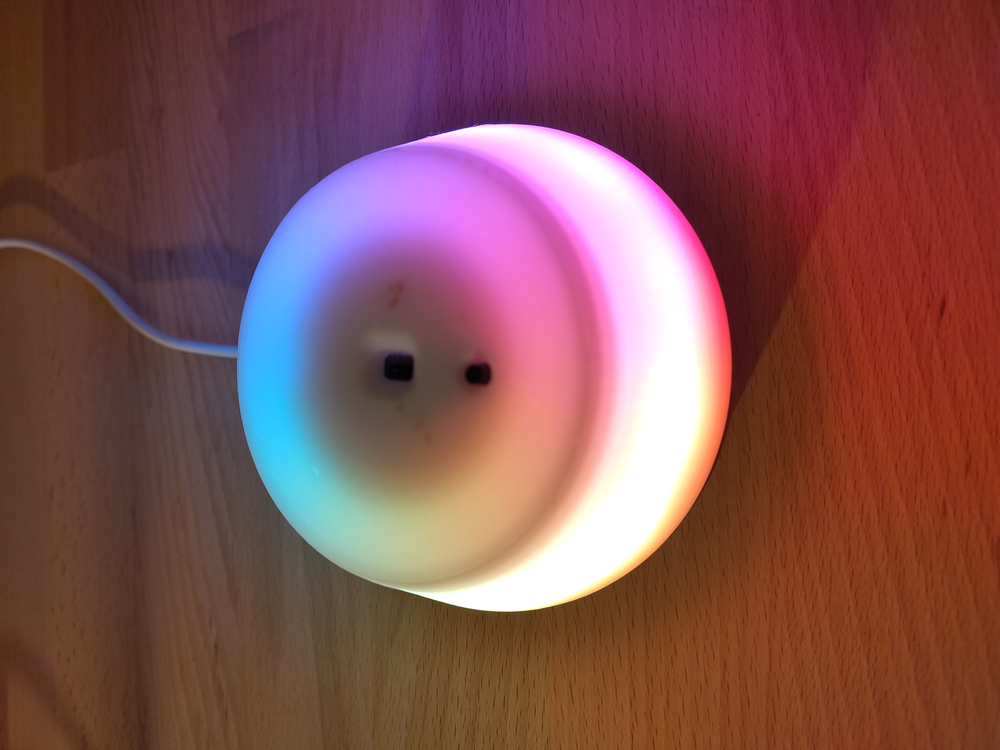</td>
    <td>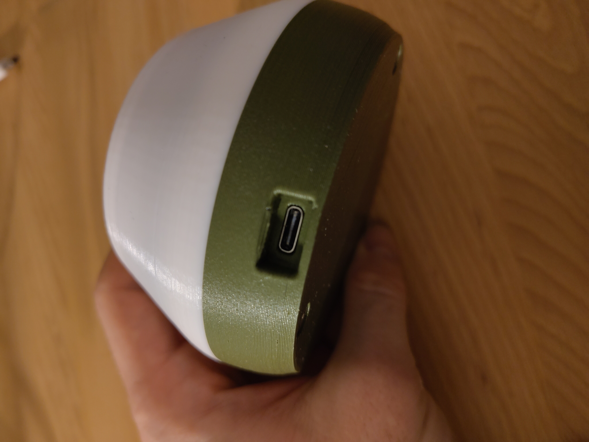</td>
  </tr>
</table>

[-> Rainbow Mode Demo Video](media/images/demo/dual_lamps_rainbow_mode.mp4)

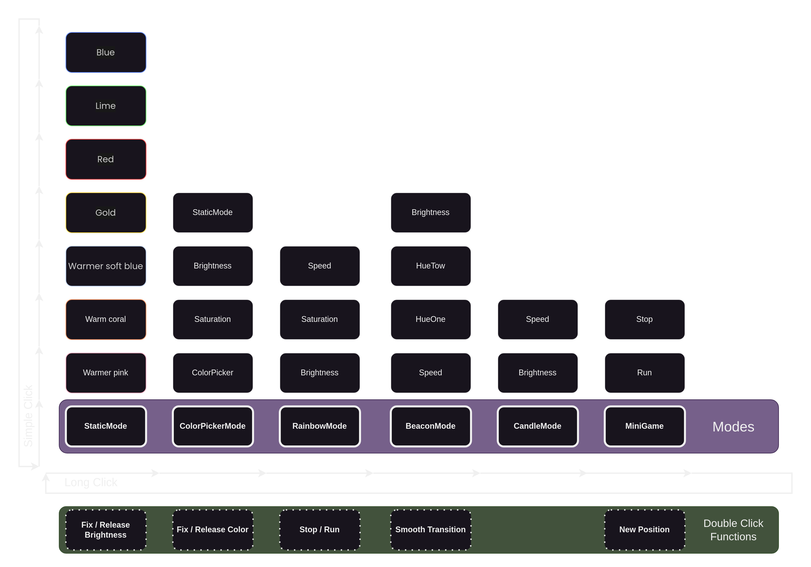

This is an overview of the different modes available in the lamp. The modes can be toggled using the button.

## 🔗 ESP-NOW Wireless Communication

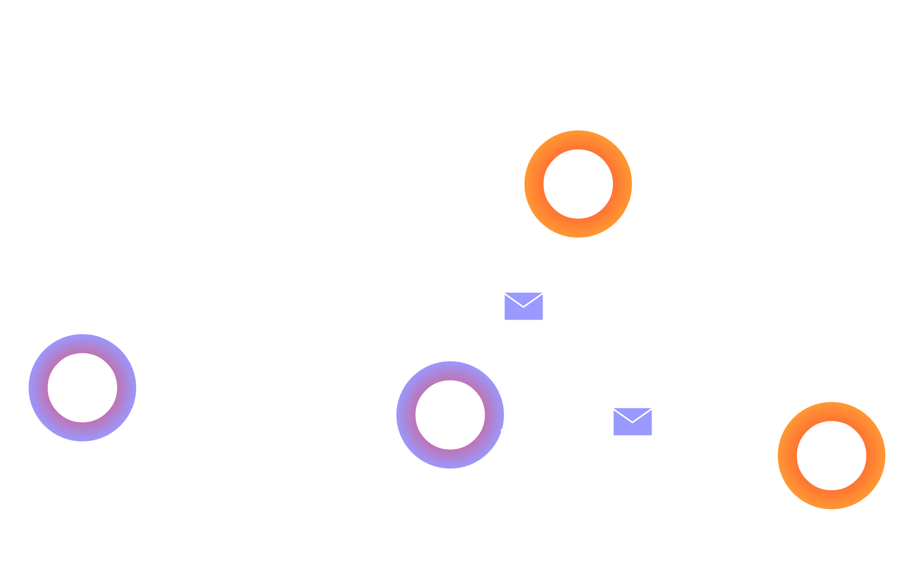

[-> Wireless Synchronization Demo Video](media/images/demo/3_lamps_communication.mp4)

GlowLight uses **ESP-NOW** for ultra-fast, low-latency wireless communication between lamps. ESP-NOW provides direct device-to-device communication without requiring a WiFi router, enabling instant synchronization across multiple lamps.

### Why ESP-NOW?

- ⚡ **Ultra-low latency**: <10ms message delivery (vs 50-200ms with traditional mesh)
- 🔋 **Energy efficient**: Minimal power consumption compared to WiFi mesh
- 📡 **Simple setup**: No SSID/password configuration needed - just power on
- 🎯 **Reliable**: Direct broadcast communication, no routing overhead
- 📶 **Good range**: Up to 200m line-of-sight
- 🔐 **Encrypted**: AES-256-GCM with a shared group key, up to 8 lamps per group

### Configuration

ESP-NOW broadcasts are not encrypted by the radio, so GlowLight encrypts and
authenticates every frame itself. All lamps of a group share one 256-bit key,
which the setup generates for you:

```bash
./install.sh    # ESP-NOW section: "create" on the first lamp, "join" on the others
```

```cpp
#define WIFI_ON false                  // Optional infrastructure WiFi
#define WIFI_SSID ""
#define WIFI_PASSWORD ""
#define GLOW_HOSTNAME "glowlight"
#define GLOW_PORTAL_ENABLED false       // Hold button during boot to activate
#define GLOW_PORTAL_PASSWORD "..."      // Unique WPA2 password from setup
#define GLOW_OTA_ENABLED false          // Updates over infrastructure WiFi
#define GLOW_OTA_PASSWORD "..."         // Separate unique update password
#define ESPNOW_CHANNEL 1              // WiFi channel (1-13), configurable
#define GLOW_GROUP_KEY_HEX "..."      // 64 hex characters, provisioned by the setup
#define GLOW_MAX_GROUP_NODES 8
#define GLOW_SYNC_FOLLOW_DEFAULT true  // Apply incoming group changes
#define GLOW_SYNC_PUBLISH_DEFAULT true // Publish local group changes
```

`WIFI_ON` is optional; ESP-NOW works without an access point. With WiFi disabled
or unavailable, every lamp parks on `ESPNOW_CHANNEL`. While connected, the access
point dictates the shared radio channel, so all lamps in a group must remain on
the same current channel. Using one access point for all WiFi-enabled lamps is the
simplest guarantee. In a mixed group with WiFi disabled on some lamps, the access
point must use `ESPNOW_CHANNEL`. Reconnect attempts are spread out and, once the
AP channel is known, short and targeted so the fallback channel remains available
for ESP-NOW most of the time.

All lamps must also share the same group key. Lamps with different keys neither
discover nor control each other. Without a valid key wireless synchronization
stays disabled.

See [docs/security.md](docs/security.md) for the security model, key rotation and
migration from older, unencrypted firmware.

Validated NVS configuration overrides these compile-time values. The optional
captive portal is opened only by holding the hardware button during boot and
runs on the ESP-NOW fallback channel without disabling secure group transport.
See [docs/configuration.md](docs/configuration.md) for provisioning, persistence
and the redacted `glow.config/1` API.

Optional OTA updates are available at `http://<hostname>.local/update` only while
infrastructure WiFi is online and require Digest authentication. See
[docs/ota.md](docs/ota.md) for the upload procedure and security boundary.

### 🏠 Home Assistant

A lamp on the WiFi can publish itself to Home Assistant over MQTT and appears
with a light, a mode selector and one control per mode setting — all generated
from the modes the firmware was built with, so nothing has to be configured by
hand. A command from Home Assistant moves the whole lamp group by default. See
[docs/home-assistant.md](docs/home-assistant.md).

### How It Works

1. **Automatic Discovery**: Lamps announce themselves via heartbeat messages (every 10 seconds)
2. **Authentication**: A new lamp is only trusted after answering a fresh challenge, so recorded traffic cannot be replayed in
3. **Instant Sync**: State changes (mode, color, brightness) are broadcast instantly to all lamps in the group
4. **No Infrastructure**: No router, server, or internet connection required
5. **Resilient**: 30-minute timeout removes inactive lamps from the network

Following incoming changes and publishing local changes are independent runtime
controls. They can be changed through the local `glow.control/1`
`sync.configure` operation. Re-enabling follow first requests a versioned state
snapshot and blocks application publishing until the lamp has safely rejoined.
See [docs/control-api.md](docs/control-api.md) for the request and status format.

`NetworkService` owns WiFi mode, access-point reconnects and the shared radio
channel. `CommunicationService` keeps its ESP-NOW broadcast peer on channel `0`
(the radio's current channel) and immediately announces the node after every
stable channel change.

For technical details, see the [CommunicationService README](lib/CommunicationService/README.md).

## 🔧 Hardware Components

- DUBEUYEW ESP32-C3 Development Board Mini
- VL53L0X distance sensor
- Simple push button (height ≥ 6mm)
- WS2812B 5V LED strip (11 LEDs)
- External 5V power supply
- USB-C and some other necessary cables
- 3x M3 threaded insert
- 3x M3 screws

### Main Components

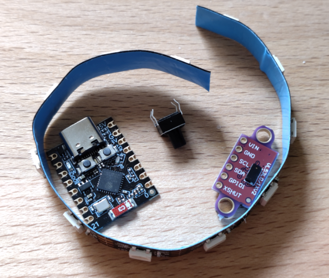

### Tools and Materials

- 3D printer + filament (white and a color of your choice)
- Soldering iron + solder
- 2x Heat shrink tube
- Screwdriver

### 3D Printing

> You can find the 3D models in the [`/printing`](/printing) folder. The models are designed to be 3D printed and assembled. The lamp consists of three parts: the base, the lampshade, and the lampshade holder.

<table>
  <tr>
    <td>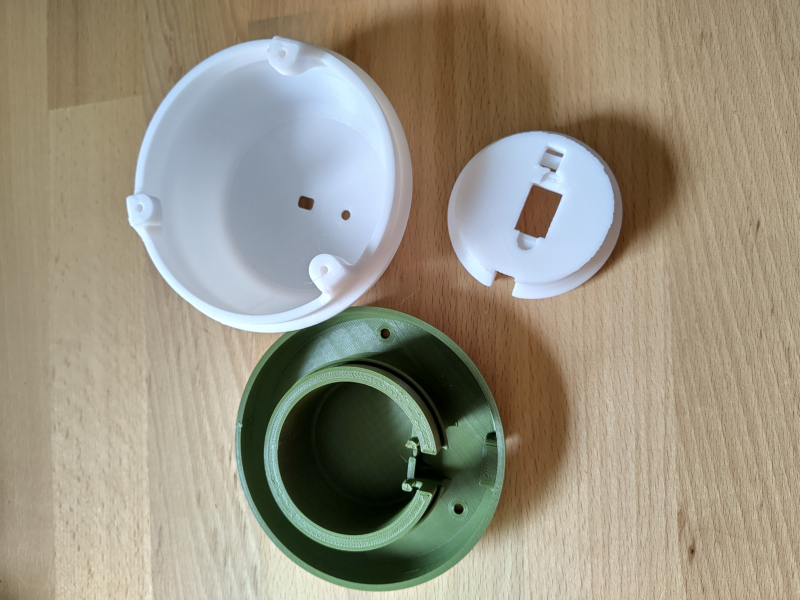</td>
    <td>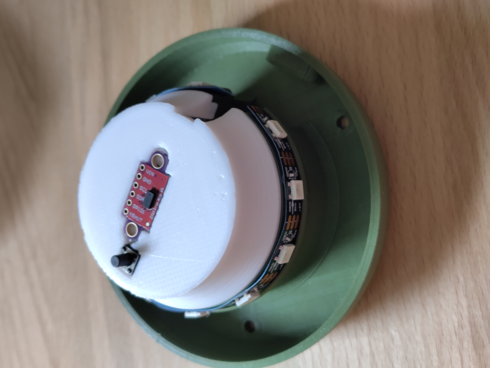</td>
    <td>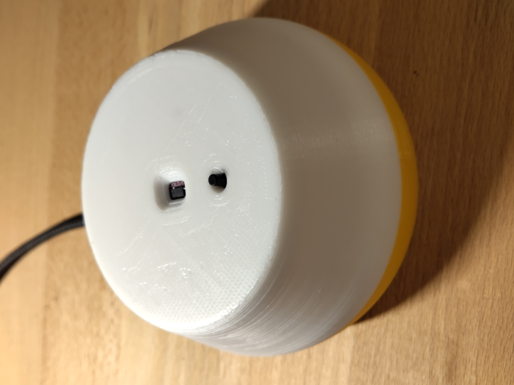</td>
  </tr>
</table>

### Soldering

The components are connected to the ESP32C3 using the following diagram:

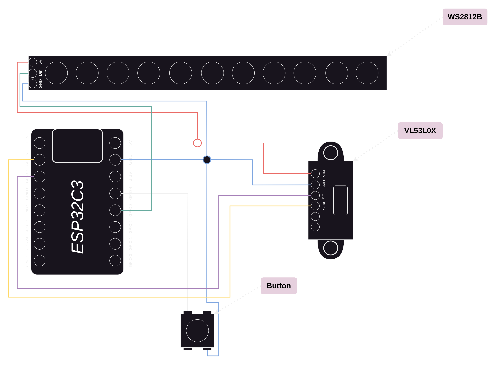

> The Button does not require a resistor, as the ESP32C3 has internal pull-up resistors.

This table also shows the connections:

| Component | Pin | ESP32C3 Pin |
| --------- | --- | ----------- |
| Button    | 1   | GND         |
|           | 2   | GPIO 4      |
| VL53L0X   | VCC | 5V          |
|           | GND | GND         |
|           | SDA | GPIO 6      |
|           | SCL | GPIO 7      |
| WS2812B   | VCC | 5V          |
|           | GND | GND         |
|           | DI  | GPIO 3      |

> The `VL53L0X` is the distance sensor, the `WS2812B` is the LED strip, and the `Button` is the push button.

<table>
  <tr>
    <td>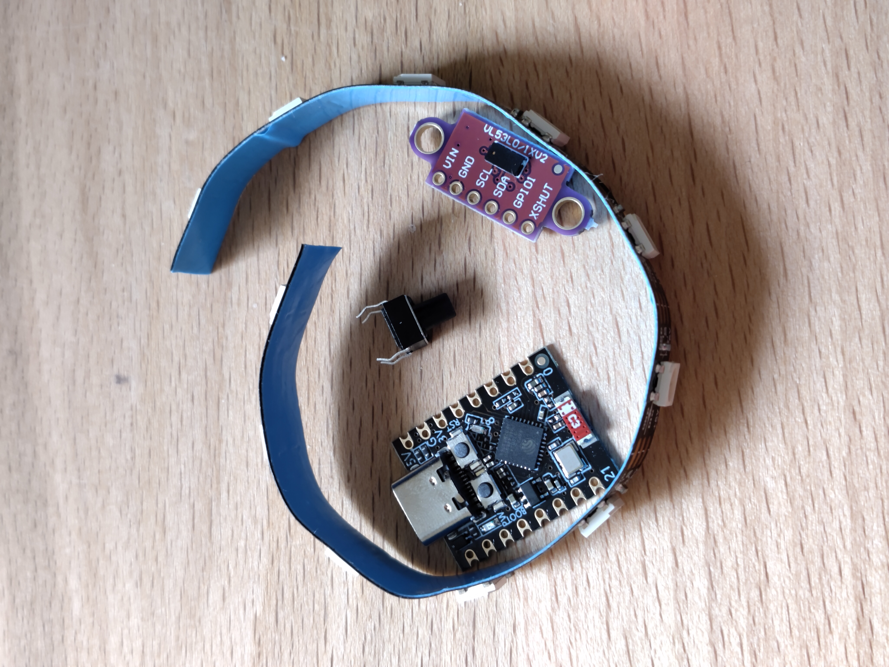</td>
    <td>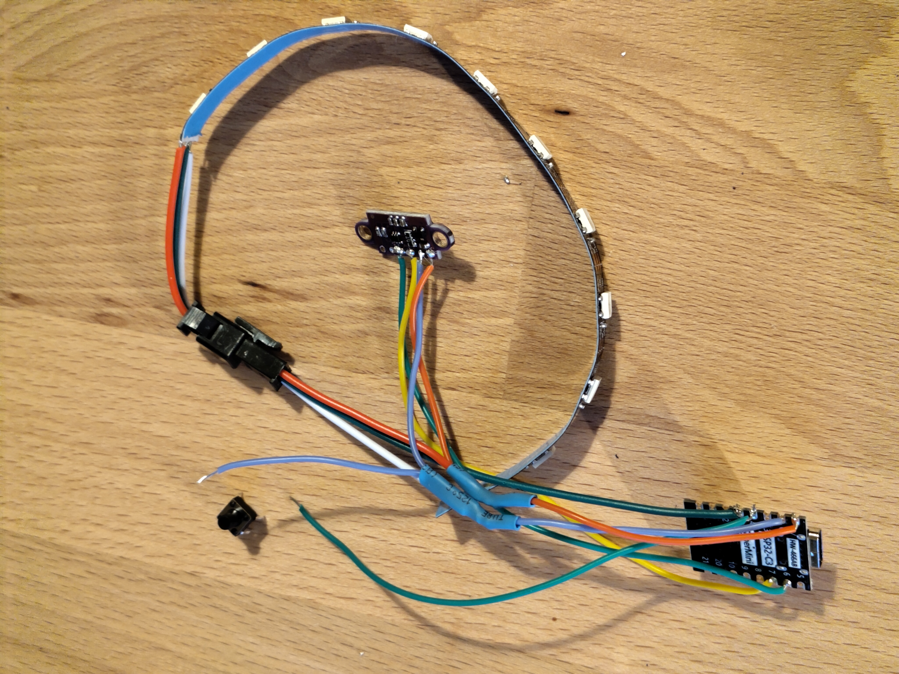</td>
  </tr>
</table>

### Threaded Insert

To attach the lampshade to the base, a threaded insert is used. The insert is placed in the base, and the lampshade is screwed onto it.

<table>
  <tr>
    <td>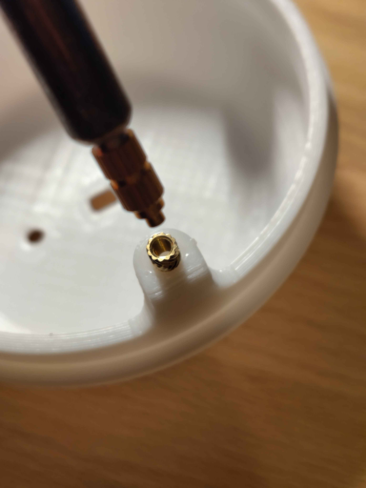</td>
    <td>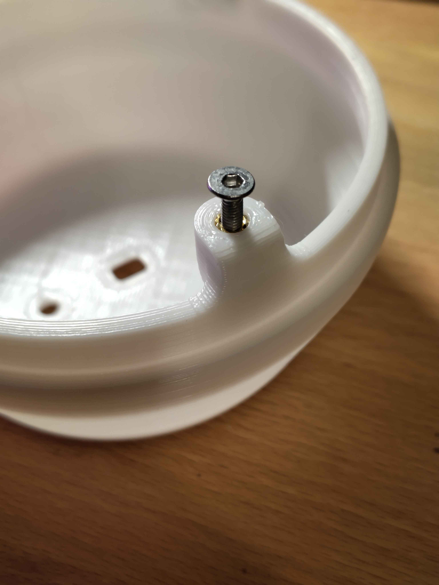</td>
    <td>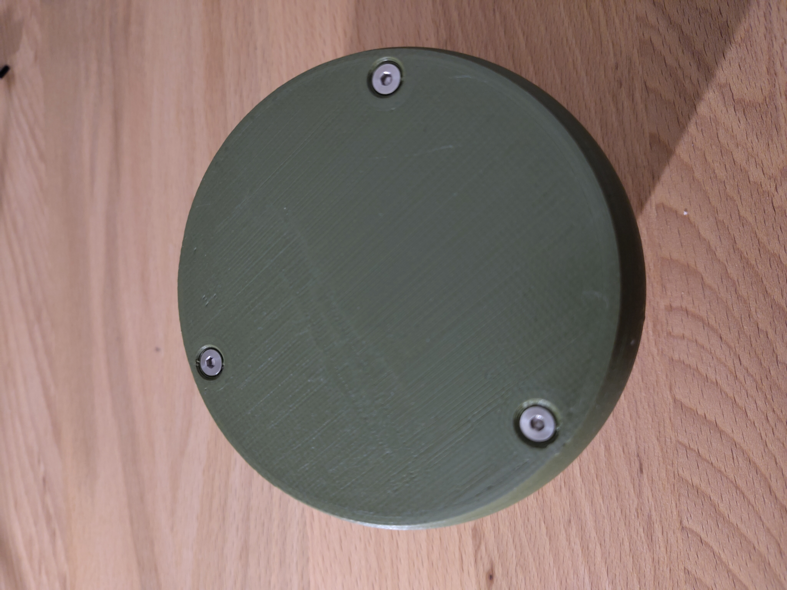</td>
  </tr>
</table>

## 🚀 Quick Setup

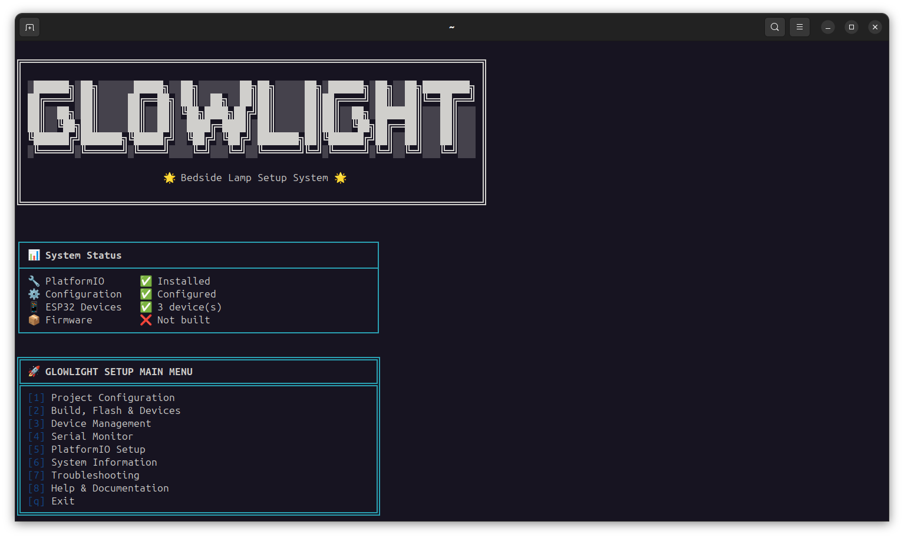

**Get started in just one command!** The GlowLight setup system will guide you through the entire installation process:

```bash
curl -fsSL https://raw.githubusercontent.com/friedjof/GlowLight/main/install.sh > install.sh && bash install.sh
```

**Alternative download method:**
```bash
wget https://raw.githubusercontent.com/friedjof/GlowLight/main/install.sh && bash install.sh
```

### What the installer does:

1. **🔍 Checks system requirements** (Python 3.8+, Git)
2. **📦 Installs dependencies** automatically for your OS (Ubuntu/Debian, Fedora, Arch, macOS)
3. **📂 Downloads the GlowLight project** to `~/GlowLight` — unless you run the script from an existing checkout, which is then used as-is
4. **🛠️ Launches the interactive setup system** with a beautiful menu interface

### Interactive Setup Features:

- **⚙️ Project Configuration**: Guided wizards for the group key, captive portal, OTA, WiFi, Home Assistant and GPIO pins
- **🔨 Build & Flash**: Compile and upload firmware to your ESP32-C3 with one click
- **📱 Device Management**: Automatic ESP32 device detection and management
- **📺 Serial Monitor**: Real-time device monitoring with logging
- **🔧 PlatformIO Setup**: Automatic PlatformIO installation and management
- **💾 Backup System**: Configuration backup and restore functionality

### Manual Installation

If you prefer to set up manually:

```bash
# Clone the repository
git clone https://github.com/friedjof/GlowLight.git
cd GlowLight

# Run the setup system
python3 scripts/setup.py
```

## 📦 Software Installation (Advanced)

This is a PlatformIO project. The setup system above handles everything automatically, but for manual installation, PlatformIO must be installed. Once installed, you can open the project in PlatformIO and flash the software onto the ESP32C3.

Alternatively, a `Makefile` is included, allowing you to flash the software via the command line. For this, PlatformIO must be installed, and the `PLATFORMIO` environment variable should point to the PlatformIO executable.

If you're familiar with Nix-shell, you can use the [`shell.nix`](/shell.nix) file to set up the environment for PlatformIO.

### PlatformIO Commands

- `pio run`: Compiles the software
- `pio run --environment esp32c3-all-modes`: Compiles and links every mode
- `pio run --environment esp32c3-integration`: Build with the serial test console
- `pio run --target upload`: Flashes the software to the ESP32C3
- `pio run --target clean`: Removes compiled files
- `pio device monitor`: Opens a terminal to view the ESP32C3 output

### Makefile Commands

Building and flashing:

- `make` or `make build`: Compiles the standard profile
- `make build-all`: Compiles and links every mode
- `make build-profiles`: Builds all three profiles and checks each fits an OTA slot
- `make flash [device-number]`: Flashes the software to the ESP32-C3
- `make flash-all`: Flashes every connected lamp with the same image — this is what puts them into one group
- `make clean`: Removes compiled files
- `make monitor [device-number]`: Opens the serial monitor
- `make run [device-number]`: Flashes the software and opens the monitor
- `make list`: Lists matching ESP32-C3 serial devices

Testing without hardware:

- `make test`: Everything that runs on the host, about a second
- `make test-native`: Protocol, control API and configuration tests against the real firmware sources
- `make test-setup`: Setup, group key handling and the host-side frame format

Testing with hardware:

- `make test-integration`: Group synchronization across all connected lamps
- `make test-isolation`: Two lamps with different keys must ignore each other
- `make test-security KEY=<64 hex>`: Replay and tampering checks against one lamp
- `make test-ota PORT=… HOST=…`: Authenticated firmware update
- `make test-homeassistant BROKER=… DEVICE=… PORT=…`: MQTT integration against a broker

### Libraries Used

- [`ArrayList`](https://registry.platformio.org/libraries/braydenanderson2014/ArrayList) for dynamic arrays
- [`Button2`](https://registry.platformio.org/libraries/lennarthennigs/Button2) for button input handling
- [`Adafruit_VL53L0X`](https://github.com/adafruit/Adafruit_VL53L0X) for the distance sensor
- [`FastLED`](https://registry.platformio.org/libraries/fastled/FastLED) for LED control
- [`ArduinoJson`](https://registry.platformio.org/libraries/bblanchon/ArduinoJson) for message serialization
- [`PubSubClient`](https://registry.platformio.org/libraries/knolleary/PubSubClient) for the optional MQTT connection
- **ESP-NOW**, **WiFi**, **mDNS**, **WebServer**, **Preferences** and **Update** (built-in ESP32 libraries)

For more details on the libraries, refer to the [`platformio.ini`](/platformio.ini) file.

## 👨‍💻 Development

The software is written in C++ and is structured as a typical PlatformIO project. The main file is [`src/main.cpp`](/src/main.cpp), which wires the services together and contains the setup and loop functions. The modes, services, and the controller live in separate libraries under [`/lib`](/lib).

### Project Structure

`Controller` sits between the modes and everything that talks to the outside
world. It derives a machine-readable capability document from what the modes
declare and offers one transport-neutral command surface, so an adapter never
needs to know about a specific mode.

| Library | Responsibility |
|---|---|
| `Controller` | Mode lifecycle, capability document, `glow.control/1` operations, group synchronization policy |
| `AbstractMode`, `GlowRegistry` | Base class for modes; typed settings with bounds and defaults that everything else is generated from |
| `LightService`, `DistanceService` | LED output and the VL53L0X proximity sensor |
| `CommunicationService` | Encrypted ESP-NOW transport: handshake, replay protection, fragmentation |
| `NetworkService` | Owns the shared radio: WiFi state machine, fallback channel, mDNS |
| `ConfigService` | Validated device configuration and its persistence in NVS |
| `CaptivePortalService` | WPA2 setup access point for provisioning without reflashing |
| `OtaService` | Password-protected firmware updates over WiFi |
| `HomeAssistantService` | MQTT adapter; the pure mapping lives in `HomeAssistantProtocol` |

Adding a mode does not touch any of the services: declare its options and
registry keys as before, register it in `src/ModeRegistration.cpp`, and it shows
up in the control API and in Home Assistant on its own.

### Documentation

- [Control API](docs/control-api.md) — capability document and JSON command surface
- [Configuration](docs/configuration.md) — provisioning, NVS persistence, captive portal
- [Security](docs/security.md) — threat model, key handling, migration from older firmware
- [Home Assistant](docs/home-assistant.md) — MQTT integration, topics, entity generation
- [OTA Updates](docs/ota.md) — upload procedure and security boundary
- [Technical Diagrams](docs/diagrams.md) — architecture and flow diagrams

### Testing

`make test` runs everything that needs no hardware. The protocol tests compile
the real `CommunicationService` on the host against thin shims for Arduino,
ESP-NOW, FreeRTOS and mbedTLS, and drive it with frames built by an independent
implementation — so the firmware and the test oracle cannot drift apart quietly.

The hardware runners in [`test/hil`](/test/hil) cover group synchronization,
group isolation, replay and tampering, OTA and the Home Assistant integration.
See [test/README](/test/README) for what each one checks and what it needs.

### Technical Diagrams

For a comprehensive understanding of the GlowLight system architecture and operation, see the [Technical Diagrams](docs/diagrams.md) which includes:

- **[Class Diagram](docs/diagrams.md#class-diagram)**: Complete class structure and relationships
- **[Main Program Flow](docs/diagrams.md#main-program-flow)**: Startup sequence and main loop execution
- **[Mode System Flow](docs/diagrams.md#mode-system-flow)**: Lighting modes management and switching
- **[Service Integration Flow](docs/diagrams.md#service-integration-flow)**: LightService, DistanceService, and CommunicationService interaction
- **[Button Interaction Flow](docs/diagrams.md#button-interaction-flow)**: Button press handling and mode switching logic
- **[ESP-NOW Communication Flow](docs/diagrams.md#esp-now-communication-flow)**: Wireless networking and synchronization
- **[Available Modes Detail](docs/diagrams.md#available-modes-detail)**: Overview of all lighting modes and their features

### Modes

Every mode is a class that inherits from the `AbstractMode` class. The abstract class already implements the basic functions that every mode should have. In every mode, the following functions must be implemented: `setup`, `customFirst`, `customLoop`, `last`, and `customClick`.

- `setup`: This function is called once when the mode is added to the controller when the lamp is turned on.
- `customFirst`: This function is called once when the mode is newly selected.
- `customLoop`: This function is called every loop iteration.
- `last`: This function is called once when the mode is removed from the controller.
- `customClick`: This function is called when a double click is detected from the button.

The constructor sets `title` for display and `id` as the stable protocol
identifier. The ID appears in group messages, in the control API and in MQTT
topics, so it must not change once lamps are in the field; the display name may.

Everything a mode declares in `setup` is what the rest of the system works from:

- `registry.init(key, type, default, min, max)` defines a setting. Its type and
  bounds become validation for remote changes and, in Home Assistant, a number,
  a switch or a text field.
- `addOption(title, callback)` registers an option, which becomes a selectable
  entry both on the button and in the control API.
- `declareCommand(name, arguments)` exposes a mode-specific action that peers and
  adapters may invoke.

Optional hooks exist for modes that need to react to state arriving from
elsewhere: `onStateApplied` after a complete state was adopted,
`onSettingChanged` for a single value, and `onStateActivated` when the mode
becomes active with restored state. Simple modes need none of them.

## 📄 License

This project is licensed under the GNU General Public License v3.0. For more information, see the [`LICENSE`](/LICENSE) file.

---

## ⚠️ Beta Notice

This is a beta version of the project. The software is still under development, and the hardware may require some adjustments. I cannot guarantee that the project will work as expected and will not be responsible for any damage caused by the project.

## 🎯 Quick Start Reminder

**New to GlowLight?** Get started with just one command:

```bash
curl -fsSL https://raw.githubusercontent.com/friedjof/GlowLight/main/install.sh | bash
```

The setup system will guide you through everything! 🚀
