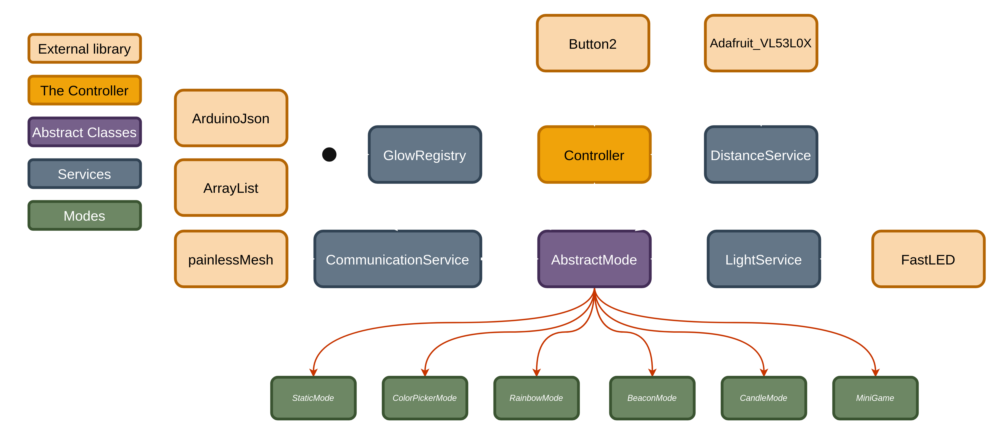

# GlowLight

This repository contains the software, schematics, and 3D printing files for a bedside lamp. The software includes various modes that can be toggled using a button. Additionally, there is a distance sensor (`VL53L0X`) that enables features such as adjusting the lamp's brightness with a hand gesture.

> This is a beta version of the project. The software is still under development, and the hardware may require some adjustments. I cannot guarantee that the project will work as expected and will not be responsible for any damage caused by the project.

## Pictures

<table>
  <tr>
    <td></td>
    <td></td>
    <td></td>
</table>

[-> Rainbow Mode Demo Video](media/images/demo/dual_lamps_rainbow_mode.mp4)

This is an overview of the different modes available in the lamp. The modes can be toggled using the button.

## Communication (NEW)

[-> Mesh Network Demo Video](media/images/demo/3_lamps_communication.mp4)

Now you can configure an mesh network between the lamps. The lamps can communicate with each other and synchronize the modes. The communication is done using the `PainlessMesh` library.

You can set the mesh ssid and password in the `include/GlowConfig.h` file. The default values are `GlowMesh` and `GlowMesh`.
This authentication is necessary to prevent unauthorized access to the mesh network and with this you can split the network in different groups.

## Hardware Components

- DUBEUYEW ESP32-C3 Development Board Mini
- VL53L0X distance sensor
- Simple push button (hight ≥ 6mm)
- WS2812B 5V LED strip (11 LEDs)
- External 5V power supply
- USB-C and some other necessary cables
- 3x M3 threaded insert
- 3x M3 screws

### Main Components

### Tools and Materials

- 3D printer + filament (white and a color of your choice)
- Soldering iron + solder
- 2x Heat shrink tube
- Screwdriver

### 3D Printing

> You can find the 3D models in the [`/printing`](/printing) folder. The models are designed to be 3D printed and assembled. The lamp consists of three parts: the base, the lampshade, and the lampshade holder.

<table>
  <tr>
    <td></td>
    <td></td>
    <td></td>
</table>

### Soldering

The components are connected to the ESP32C3 using the following diagram:

> The Button does not require a resistor, as the ESP32C3 has internal pull-up resistors.

This table also shows the connections:

| Component | Pin | ESP32C3 Pin |
| --------- | --- | ----------- |
| Button    | 1   | GND         |
|           | 2   | GPIO 4      |
| VL53L0X   | VCC | 5V          |
|           | GND | GND         |
|           | SDA | GPIO 6      |
|           | SCL | GPIO 7      |
| WS2812B   | VCC | 5V          |
|           | GND | GND         |
|           | DI  | GPIO 3      |

> The `VL53L0X` is the distance sensor, the `WS2812B` is the LED strip, and the `Button` is the push button.

<table>
  <tr>
    <td></td>
    <td></td>
</table>

### Threaded Insert

To attach the lampshade to the base, a threaded insert is used. The insert is placed in the base, and the lampshade is screwed onto it.

<table>
  <tr>
    <td></td>
    <td></td>
    <td></td>
  </tr>
</table>

## Software Installation

This is a PlatformIO project. To compile and flash the software to the ESP32C3, PlatformIO must be installed. Once installed, you can open the project in PlatformIO and flash the software onto the ESP32C3.

Alternatively, a `Makefile` is included, allowing you to flash the software via the command line. For this, PlatformIO must be installed, and the `PLATFORMIO` environment variable should point to the PlatformIO executable.

If you're familiar with Nix-shell, you can use the [`shell.nix`](/shell.nix) file to set up the environment for PlatformIO.

### PlatformIO Commands

- `pio run`: Compiles the software
- `pio run --target upload`: Flashes the software to the ESP32C3
- `pio run --target clean`: Removes compiled files
- `pio device monitor`: Opens a terminal to view the ESP32C3 output

### Makefile Commands

- `make`: Compiles the software
- `make upload`: Flashes the software to the ESP32C3
- `make clean`: Removes compiled files
- `make monitor`: Opens a terminal to view the ESP32C3 output
- `make flash`: Flashes the software and opens the monitor
- `make start`: Cleans, compiles, flashes the software, and opens the monitor

### Libraries Used

- [`ArrayList`](https://registry.platformio.org/libraries/braydenanderson2014/ArrayList) for dynamic arrays
- [`Button2`](https://registry.platformio.org/libraries/lennarthennigs/Button2) for button input handling
- [`Adafruit_VL53L0X`](https://github.com/adafruit/Adafruit_VL53L0X) for the distance sensor
- [`FastLED`](https://registry.platformio.org/libraries/fastled/FastLED) for LED control

For more details on the libraries, refer to the [`platformio.ini`](/platformio.ini) file.

## Development

The software is written in C++ and is structured as a typical PlatformIO project. The main file is [`src/main.cpp`](/src/main.cpp), which contains the setup and loop functions. The different modes, services and the controller are implemented in separate files in the [`/lib`](/lib) folder.

### Classes

### Modes

Every Mode is a class that inherits from the `AbstractMode` class. The abstract class already implements the basic functions that every mode should have. In every mode, the following functions must be implemented: `setup`, `customFirst`, `customLoop`, `last`, and `customClick`.

- `setup`: This function is called once when the mode is added to the controller when the lamp is turned on.
- `customFirst`: This function is called once when the mode is newly selected.
- `customLoop`: This function is called every loop iteration.
- `last`: This function is called once when the mode is removed from the controller.
- `customClick`: This function is called when a double click is detected from the button.

## License

This project is licensed under the GNU General Public License v3.0. For more information, see the [`LICENSE`](/LICENSE) file.
