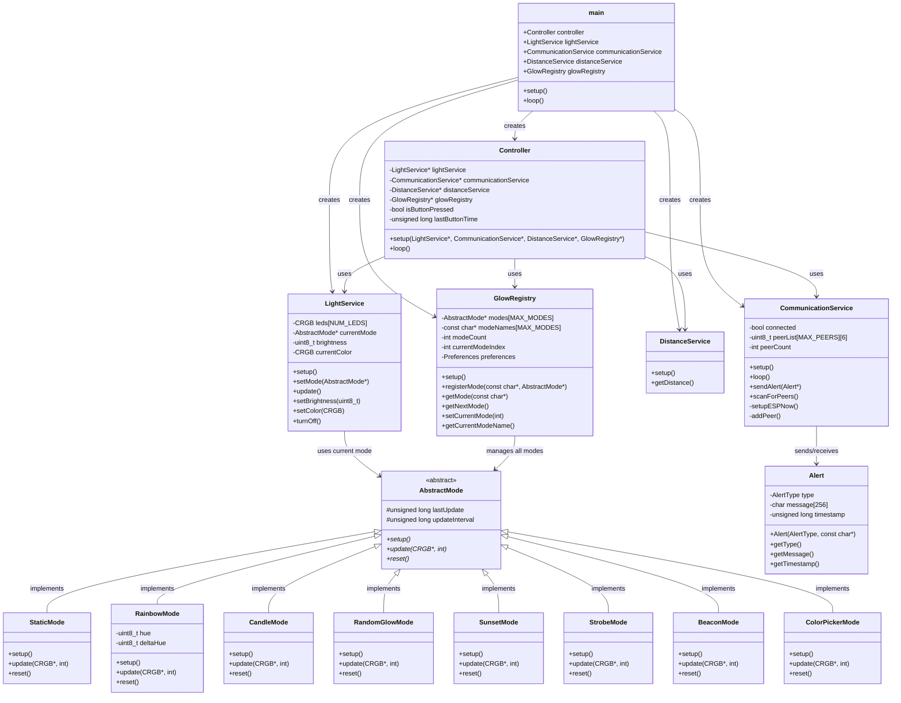
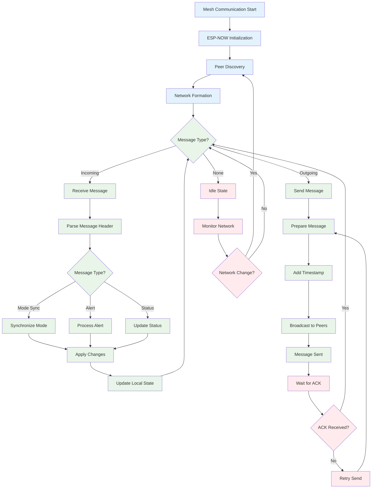

# GlowLight - Technical Diagrams

This document contains all technical diagrams for the GlowLight Smart Mesh Bedside Lamp project, including class relationships and program flow visualizations.

## Table of Contents

- [Class Diagram](#class-diagram)
- [Program Flow Diagrams](#program-flow-diagrams)
  - [Main Program Flow](#main-program-flow)
  - [Mode System Flow](#mode-system-flow)
  - [Service Integration Flow](#service-integration-flow)
  - [Button Interaction Flow](#button-interaction-flow)
  - [Mesh Communication Flow](#mesh-communication-flow)
  - [Available Modes Detail](#available-modes-detail)

## Class Diagram

This diagram shows the complete class structure and relationships within the GlowLight system.



## Program Flow Diagrams

### Main Program Flow

This diagram shows the complete program execution from system startup through the main loop.

```mermaid
flowchart TD
    A[System Start] --> B[setup() Function]
    
    %% Setup Phase
    B --> C[Serial.begin(115200)]
    C --> D[Wire.begin() - I2C Setup]
    D --> E[Services Setup]
    
    %% Service Setup Details
    E --> E1[lightService.setup()]
    E --> E2[distanceService.setup()]
    E --> E3[communicationService.setup()]
    E1 --> F[Button Setup]
    E2 --> F
    E3 --> F
    
    %% Button Configuration
    F --> F1[button.begin(BUTTON_PIN)]
    F1 --> F2[button.setLongClickTime(500)]
    F2 --> G[Mode Registration]
    
    %% Mode Registration
    G --> G1[controller.addMode(&staticMode)]
    G1 --> G2[controller.addMode(&colorPickerMode)]
    G2 --> G3[controller.addMode(&rainbowMode)]
    G3 --> G4[controller.addMode(&randomGlowMode)]
    G4 --> H[Alert Mode Setup]
    
    %% Controller Setup
    H --> H1[controller.setAlertMode(&alertMode)]
    H1 --> I[controller.setup()]
    I --> J[Button Handler Setup]
    
    %% Button Handlers
    J --> J1[setLongClickHandler - nextMode()]
    J1 --> J2[setClickHandler - nextOption()]
    J2 --> J3[setDoubleClickHandler - customClick()]
    J3 --> K[Setup Complete]
    
    %% Main Loop
    K --> L[loop() Function - Infinite Loop]
    L --> M[Service Loop Calls]
    
    %% Loop Details
    M --> M1[button.loop()]
    M --> M2[controller.loop()]
    M --> M3[lightService.loop()]
    M --> M4[distanceService.loop()]
    M --> M5[communicationService.loop()]
    
    M1 --> N{Button Event?}
    M2 --> O{Distance Change?}
    M3 --> P{LED Update?}
    M4 --> Q{Mesh Message?}
    M5 --> R[Update LEDs]
    
    %% Button Events
    N -->|Long Click| N1[controller.nextMode()]
    N -->|Single Click| N2[controller.nextOption()]
    N -->|Double Click| N3[controller.customClick()]
    N -->|No Event| R
    
    %% Distance Events
    O -->|Yes| O1[Process Distance Data]
    O -->|No| R
    O1 --> O2{ColorPicker Mode?}
    O2 -->|Yes| O3[Update Color Based on Distance]
    O2 -->|No| R
    
    %% LED Updates
    P -->|Yes| P1[FastLED.show()]
    P -->|No| R
    
    %% Mesh Communication
    Q -->|Yes| Q1[Process Mesh Data]
    Q -->|No| R
    Q1 --> Q2[Synchronize with Other Lamps]
    
    %% Continue Loop
    N1 --> R
    N2 --> R
    N3 --> R
    O3 --> R
    P1 --> R
    Q2 --> R
    R --> L
    
    %% Styling
    classDef setupPhase fill:#e1f5fe
    classDef loopPhase fill:#f3e5f5
    classDef buttonEvent fill:#fff3e0
    classDef serviceEvent fill:#e8f5e8
    classDef decision fill:#ffebee
    
    class A,B,C,D,E,E1,E2,E3,F,F1,F2,G,G1,G2,G3,G4,H,H1,I,J,J1,J2,J3,K setupPhase
    class L,M,M1,M2,M3,M4,M5,R loopPhase
    class N1,N2,N3 buttonEvent
    class O1,O2,O3,P1,Q1,Q2 serviceEvent
    class N,O,P,Q decision
```

### Mode System Flow

This diagram illustrates how lighting modes are managed, switched, and executed.

```mermaid
flowchart TD
    A[Mode System Start] --> B[Controller Setup]
    B --> C[Mode Array Initialization]
    C --> D[Current Mode = staticMode]
    
    D --> E{Button Long Click?}
    E -->|Yes| F[controller.nextMode()]
    E -->|No| G{Button Single Click?}
    
    F --> F1[currentModeIndex++]
    F1 --> F2{Index >= modeCount?}
    F2 -->|Yes| F3[currentModeIndex = 0]
    F2 -->|No| F4[Switch to New Mode]
    F3 --> F4
    
    F4 --> F5[oldMode.last()]
    F5 --> F6[newMode.setup()]
    F6 --> F7[newMode.customFirst()]
    F7 --> H[Mode Active]
    
    G -->|Yes| I[controller.nextOption()]
    G -->|No| J{Button Double Click?}
    
    I --> I1[currentMode.nextOption()]
    I1 --> H
    
    J -->|Yes| K[controller.customClick()]
    J -->|No| H
    
    K --> K1[currentMode.customClick()]
    K1 --> H
    
    H --> L[Mode Loop Execution]
    L --> L1[currentMode.customLoop()]
    L1 --> L2[Update LEDs]
    L2 --> M{Distance Sensor Active?}
    
    M -->|Yes| N[Process Distance Input]
    M -->|No| O{Mesh Message?}
    
    N --> N1{ColorPicker Mode?}
    N1 -->|Yes| N2[Map Distance to Color]
    N1 -->|No| O
    N2 --> O
    
    O -->|Yes| P[Synchronize Mode State]
    O -->|No| Q[Continue Loop]
    P --> Q
    Q --> E
    
    %% Styling
    classDef modeControl fill:#e3f2fd
    classDef buttonAction fill:#fff8e1
    classDef modeExecution fill:#e8f5e8
    classDef decision fill:#ffebee
    
    class A,B,C,D setupPhase
    class F,F1,F2,F3,F4,F5,F6,F7,I,I1,K,K1 buttonAction
    class H,L,L1,L2,N,N1,N2,P modeExecution
    class E,G,J,M,O,Q decision
```

### Service Integration Flow

This diagram shows how the three core services interact with each other and the controller.

```mermaid
flowchart TD
    A[Service Integration] --> B[LightService]
    A --> C[DistanceService]
    A --> D[CommunicationService]
    
    %% LightService Flow
    B --> B1[FastLED Setup]
    B1 --> B2[LED Array Initialization]
    B2 --> B3[Default Brightness Setup]
    B3 --> B4{Mode Update Required?}
    B4 -->|Yes| B5[Update LED Colors]
    B4 -->|No| B6[FastLED.show()]
    B5 --> B6
    B6 --> B7[Wait for Next Update]
    B7 --> B4
    
    %% DistanceService Flow
    C --> C1[VL53L0X Sensor Setup]
    C1 --> C2[I2C Communication Setup]
    C2 --> C3{Distance Reading Request?}
    C3 -->|Yes| C4[Read Sensor Data]
    C3 -->|No| C5[Wait]
    C4 --> C6[Process Distance Value]
    C6 --> C7{Valid Reading?}
    C7 -->|Yes| C8[Return Distance]
    C7 -->|No| C9[Return Error Value]
    C8 --> C5
    C9 --> C5
    C5 --> C3
    
    %% CommunicationService Flow
    D --> D1[ESP-NOW Setup]
    D1 --> D2[Mesh Network Join]
    D2 --> D3[Peer Discovery]
    D3 --> D4{Mesh Message Received?}
    D4 -->|Yes| D5[Parse Message]
    D4 -->|No| D6{Send Message Required?}
    D5 --> D7{Mode Sync Message?}
    D7 -->|Yes| D8[Update Local Mode]
    D7 -->|No| D9[Process Other Message]
    D8 --> D6
    D9 --> D6
    D6 -->|Yes| D10[Broadcast to Mesh]
    D6 -->|No| D11[Continue]
    D10 --> D11
    D11 --> D4
    
    %% Service Integration Points
    B8[LED Update Event] --> E[Controller Integration]
    C10[Distance Change Event] --> E
    D12[Mesh Sync Event] --> E
    
    E --> F{Event Type?}
    F -->|LED Update| G[Update Current Mode Display]
    F -->|Distance Change| H[Process Distance for Current Mode]
    F -->|Mesh Sync| I[Synchronize Mode State]
    
    G --> J[Services Continue]
    H --> J
    I --> J
    J --> B4
    J --> C3
    J --> D4
    
    %% Styling
    classDef lightService fill:#fff3e0
    classDef distanceService fill:#e8f5e8
    classDef commService fill:#e3f2fd
    classDef integration fill:#f3e5f5
    
    class B,B1,B2,B3,B4,B5,B6,B7,B8 lightService
    class C,C1,C2,C3,C4,C5,C6,C7,C8,C9,C10 distanceService
    class D,D1,D2,D3,D4,D5,D6,D7,D8,D9,D10,D11,D12 commService
    class E,F,G,H,I,J integration
```

### Button Interaction Flow

This diagram details the button press handling and resulting actions.

```mermaid
flowchart TD
    A[Button Press Detected] --> B{Button Type?}
    
    B -->|Long Click 500ms+| C[nextMode()]
    B -->|Single Click| D[nextOption()]
    B -->|Double Click| E[customClick()]
    
    C --> C1[Increment Mode Index]
    C1 --> C2{Index Overflow?}
    C2 -->|Yes| C3[Reset to First Mode]
    C2 -->|No| C4[Select New Mode]
    C3 --> C4
    C4 --> C5[Call currentMode.last()]
    C5 --> C6[Call newMode.setup()]
    C6 --> C7[Call newMode.customFirst()]
    C7 --> F[Mode Switched]
    
    D --> D1[Call currentMode.nextOption()]
    D1 --> D2[Mode-Specific Option Change]
    D2 --> G[Option Changed]
    
    E --> E1[Call currentMode.customClick()]
    E1 --> E2[Mode-Specific Custom Action]
    E2 --> H[Custom Action Executed]
    
    F --> I[Continue Loop]
    G --> I
    H --> I
    I --> A
    
    %% Styling
    classDef buttonInput fill:#fff3e0
    classDef modeChange fill:#e3f2fd
    classDef optionChange fill:#e8f5e8
    classDef customAction fill:#f3e5f5
    
    class A,B buttonInput
    class C,C1,C2,C3,C4,C5,C6,C7,F modeChange
    class D,D1,D2,G optionChange
    class E,E1,E2,H customAction
```

### Mesh Communication Flow

This diagram shows the ESP-NOW mesh networking and synchronization process.



### Available Modes Detail

This diagram provides an overview of all available lighting modes and their features.

```mermaid
flowchart LR
    A[Available Modes] --> B[StaticMode]
    A --> C[ColorPickerMode]
    A --> D[RainbowMode]
    A --> E[RandomGlowMode]
    
    F[Commented Modes] --> G[BeaconMode]
    F --> H[CandleMode]
    F --> I[SunsetMode]
    F --> J[StrobeMode]
    F --> K[MiniGame]
    
    %% StaticMode Details
    B --> B1[Single Solid Color]
    B1 --> B2[Brightness Control]
    B2 --> B3[Color Selection via Distance]
    
    %% ColorPickerMode Details
    C --> C1[Distance-Based Color Selection]
    C1 --> C2[Real-time Color Change]
    C2 --> C3[Smooth Color Transitions]
    
    %% RainbowMode Details
    D --> D1[Flowing Rainbow Effect]
    D1 --> D2[Adjustable Speed]
    D2 --> D3[Mesh Synchronization]
    
    %% RandomGlowMode Details
    E --> E1[10 Scientific Colors]
    E1 --> E2[Speed Modes: Zen→Party]
    E2 --> E3[Pause/Transition Cycles]
    
    %% Alert Mode (Special)
    L[Alert Mode] --> L1[System Notifications]
    L1 --> L2[Error Indicators]
    L2 --> L3[Status Communication]
    
    %% Styling
    classDef activeMode fill:#e8f5e8
    classDef commentedMode fill:#ffebee
    classDef specialMode fill:#fff3e0
    
    class B,C,D,E,B1,B2,B3,C1,C2,C3,D1,D2,D3,E1,E2,E3 activeMode
    class F,G,H,I,J commentedMode
    class L,L1,L2,L3 specialMode
